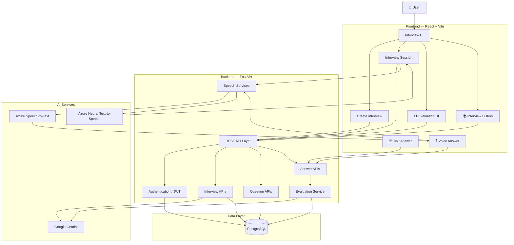
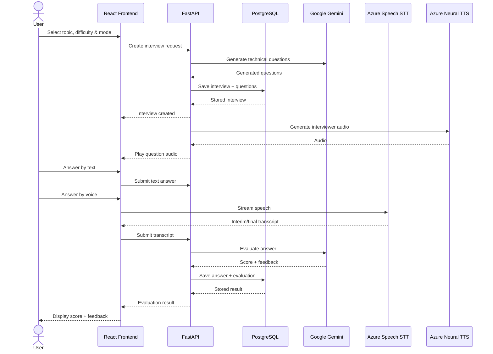

# 🏗️ System Architecture

IntervueAI follows a full-stack architecture where the React frontend communicates with a FastAPI backend through REST APIs. PostgreSQL stores users, interviews, questions, answers, and evaluation data. Google Gemini powers interview question generation and answer evaluation, while Azure Speech services provide voice-based interview interaction.

The application supports **both text-based and voice-based answering**, with both paths ultimately converging into the same backend answer submission and evaluation pipeline.

---

## 🔭 High-Level Architecture



---

# 🔄 Complete Application Flow

The complete interview lifecycle can be represented as:

```text
                         ┌─────────────────┐
                         │      USER       │
                         └────────┬────────┘
                                  │
                                  ▼
                    ┌─────────────────────────┐
                    │ Register / Login        │
                    │ JWT Authentication      │
                    └────────────┬────────────┘
                                 │
                                 ▼
                    ┌─────────────────────────┐
                    │ Create Interview        │
                    │                         │
                    │ • Topic                 │
                    │ • Difficulty            │
                    │ • Interview Mode        │
                    └────────────┬────────────┘
                                 │
                                 ▼
                    ┌─────────────────────────┐
                    │ Topic Search             │
                    │                         │
                    │ Automatic Category       │
                    │ Detection                │
                    └────────────┬────────────┘
                                 │
                                 ▼
                    ┌─────────────────────────┐
                    │ FastAPI Backend         │
                    └────────────┬────────────┘
                                 │
                                 ▼
                    ┌─────────────────────────┐
                    │ Google Gemini           │
                    │ Question Generation     │
                    └────────────┬────────────┘
                                 │
                                 ▼
                    ┌─────────────────────────┐
                    │ PostgreSQL              │
                    │ Store Interview +       │
                    │ Questions               │
                    └────────────┬────────────┘
                                 │
                                 ▼
                    ┌─────────────────────────┐
                    │ Interview Session       │
                    └────────────┬────────────┘
                                 │
                     ┌───────────┴───────────┐
                     │                       │
                     ▼                       ▼
              ┌──────────────┐       ┌──────────────┐
              │ Text Answer  │       │ Voice Answer │
              └──────┬───────┘       └──────┬───────┘
                     │                       │
                     │                       ▼
                     │                Azure Speech
                     │                Speech-to-Text
                     │                       │
                     │                       ▼
                     │                Live Transcript
                     │                       │
                     └───────────┬───────────┘
                                 │
                                 ▼
                    ┌─────────────────────────┐
                    │ Submit Answer           │
                    └────────────┬────────────┘
                                 │
                                 ▼
                    ┌─────────────────────────┐
                    │ Google Gemini           │
                    │ Answer Evaluation       │
                    └────────────┬────────────┘
                                 │
                                 ▼
                    ┌─────────────────────────┐
                    │ Score + Feedback        │
                    └────────────┬────────────┘
                                 │
                                 ▼
                    ┌─────────────────────────┐
                    │ PostgreSQL              │
                    │ Store Evaluation        │
                    └────────────┬────────────┘
                                 │
                                 ▼
                    ┌─────────────────────────┐
                    │ Evaluation Dashboard    │
                    └─────────────────────────┘
```

---

# 📝 1. Interview Creation Flow

The interview begins when the user opens the **Create Interview** page.

The user provides:

```text
Topic
Difficulty
Interview Mode
```

The application follows a **topic-first approach**.

For example:

```text
tree
redis
docker
fastapi
jwt
react
tcp
```

The platform searches the technical catalogue and automatically identifies the relevant category.

Example:

```text
User searches:

Redis

        ↓

Technical Catalogue

        ↓

Topic: Redis
Category: Backend / Databases
```

The category is displayed as information rather than requiring the user to manually select it.

---

# 🤖 2. AI Interview Generation

After the user selects the topic, difficulty, and interview mode:

```text
React
  │
  │ POST /interviews
  ▼
FastAPI
  │
  ▼
Interview Creation
  │
  ▼
Google Gemini
```

Gemini receives the interview configuration and generates technical interview questions appropriate for the selected topic and difficulty.

Example:

```text
Topic:
Data Structures

Difficulty:
Medium

Interview Mode:
Technical Interview
```

Gemini generates questions such as:

```text
1. What is the time complexity of binary search?

2. Explain the difference between a stack and a queue.

3. How does a hash table handle collisions?

...
```

The generated interview and questions are then persisted in PostgreSQL.

---

# 💾 3. Database Flow

PostgreSQL acts as the persistent data layer.

Conceptually, the relationships are:

```text
                    ┌──────────────┐
                    │    users     │
                    └──────┬───────┘
                           │
                           │ 1:N
                           ▼
                    ┌──────────────┐
                    │  interviews  │
                    └──────┬───────┘
                           │
                           │ 1:N
                           ▼
                    ┌──────────────┐
                    │   questions  │
                    └──────┬───────┘
                           │
                           │
                           ▼
                    ┌──────────────┐
                    │    answers   │
                    └──────┬───────┘
                           │
                           ▼
                    ┌──────────────┐
                    │  evaluation  │
                    └──────────────┘
```

This allows the application to maintain the complete interview lifecycle.

---

# 🎤 4. Interviewer Voice / Text-to-Speech Flow

The interview experience can use an AI interviewer voice.

When the application needs to speak a question:

```text
Interview Question
       │
       ▼
React Frontend
       │
       │ Request speech
       ▼
FastAPI
       │
       ▼
Azure Neural Text-to-Speech
       │
       ▼
Audio Response
       │
       ▼
React
       │
       ▼
🔊 AI Interviewer Voice
```

The generated audio is returned to the frontend and played for the user.

The backend keeps the Azure credentials protected rather than exposing the sensitive service configuration directly to the browser.

---

# 🎙️ 5. Voice Answer Flow

Voice answering is handled separately from text input.

The user can answer an interview question by speaking naturally.

```text
                 👤 USER
                    │
                    │ speaks
                    ▼
             🎙️ Microphone
                    │
                    ▼
          Browser Speech Capture
                    │
                    ▼
          Azure Speech-to-Text
                    │
          ┌─────────┴─────────┐
          │                   │
          ▼                   ▼
    Interim Transcript    Final Transcript
          │                   │
          └─────────┬─────────┘
                    ▼
             React Interview UI
                    │
                    ▼
              User sees text
                    │
                    ▼
              Submit Answer
```

### Live transcription

The voice interface supports continuous speech recognition.

While the user is speaking, the frontend can receive:

```text
Interim transcript
       ↓
"I think binary search..."
```

As speech becomes finalized:

```text
Final transcript
       ↓
"I think binary search has O(log n) complexity because
the search space is divided in half."
```

The final transcript becomes the answer submitted to the backend.

---

# 🔐 6. Secure Azure Speech Token Flow

The browser should not receive the permanent Azure Speech secret.

Instead:

```text
React
  │
  │ Request temporary speech authorization
  ▼
FastAPI
  │
  │ Uses server-side Azure credentials
  ▼
Azure Speech
  │
  │ Temporary authorization
  ▼
React
  │
  ▼
Browser Speech Recognition
```

This keeps the long-lived Azure credentials on the backend.

---

# ⌨️ 7. Text Answer Flow

Users can also answer questions using normal text input.

```text
             👤 USER
                │
                │ types answer
                ▼
        ┌─────────────────┐
        │ Text Input      │
        │ React Component │
        └────────┬────────┘
                 │
                 ▼
          Answer State
                 │
                 ▼
          Submit Answer
                 │
                 ▼
        FastAPI Answer API
                 │
                 ▼
           PostgreSQL
                 │
                 ▼
          Answer Stored
```

The important point is that **text and voice answers eventually become the same type of answer data**.

---

# 🔀 8. Text + Voice Convergence

This is one of the important architectural aspects of the project.

The platform doesn't need separate evaluation logic for text and voice.

Both paths converge:

```text
                  Interview Question
                         │
              ┌──────────┴──────────┐
              │                     │
              ▼                     ▼
       ⌨️ Text Answer         🎙️ Voice Answer
              │                     │
              │              Azure Speech-to-Text
              │                     │
              │                     ▼
              │              Final Transcript
              │                     │
              └──────────┬──────────┘
                         │
                         ▼
                   Answer Text
                         │
                         ▼
                  FastAPI Backend
                         │
                         ▼
                   AI Evaluation
                         │
                         ▼
                      Gemini
                         │
                         ▼
                 Score + Feedback
```

Therefore, the evaluation system is **input-modality independent**.

Whether the user typed:

```text
O(log n)
```

or said:

> "The complexity is O of log n because we keep dividing the search space in half."

the backend ultimately evaluates the answer as text.

---

# 🧠 9. AI Answer Evaluation

After the user submits an answer:

```text
Question
    +
Expected Answer / Evaluation Context
    +
User Answer
        │
        ▼
    FastAPI
        │
        ▼
   Google Gemini
        │
        ▼
┌──────────────────────┐
│ AI Evaluation        │
│                      │
│ • Correctness        │
│ • Relevance          │
│ • Explanation        │
│ • Score              │
│ • Feedback           │
└──────────┬───────────┘
           │
           ▼
      PostgreSQL
           │
           ▼
   Evaluation UI
```

The user receives structured feedback rather than simply a correct/incorrect result.

Example:

```text
Score: 8/10

Strengths:
- Correct complexity
- Correct reasoning

Areas to improve:
- Explain why the search space is halved
- Mention the worst-case number of iterations
```

---

# 📊 10. Evaluation Flow

The complete evaluation lifecycle is:

```text
User Answer
     │
     ▼
Submit Answer
     │
     ▼
FastAPI
     │
     ├── Validate user
     ├── Validate interview
     ├── Validate question
     └── Validate answer
     │
     ▼
Gemini Evaluation
     │
     ▼
Structured Evaluation
     │
     ├── Score
     ├── Correctness
     ├── Relevance
     ├── Feedback
     └── Improvement areas
     │
     ▼
PostgreSQL
     │
     ▼
Frontend
     │
     ▼
Evaluation Result
```

---

# 🎭 11. Interview UI State Flow

The interview interface also reflects the current interaction state.

Conceptually:

```text
                    IDLE
                      │
                      ▼
                AI SPEAKING
                      │
                      ▼
              USER LISTENING
                      │
                      ▼
              USER SPEAKING
                      │
                      ▼
             ANSWER RECEIVED
                      │
                      ▼
                SUBMITTING
                      │
                      ▼
                EVALUATING
                      │
                      ▼
                NEXT QUESTION
                      │
                      ▼
                AI SPEAKING
```

The interviewer avatar can visually communicate states such as:

* AI speaking
* User speaking
* Listening
* Submitting
* Evaluating
* Idle

This makes the interview experience feel closer to an actual interactive interview rather than a static question-and-answer form.

---

# 🔐 12. Authentication Flow

Authentication uses JWT.

```text
             User
              │
              ▼
        Register / Login
              │
              ▼
           FastAPI
              │
       ┌──────┴──────┐
       │             │
       ▼             ▼
   Password       PostgreSQL
   Hashing
       │
       ▼
     JWT Token
       │
       ▼
    React Client
       │
       │ Authorization: Bearer <token>
       ▼
 Protected API
```

Protected endpoints verify the JWT before allowing access to user-specific resources.

---

# 🔒 13. API Security Flow

For protected interview operations:

```text
Frontend
   │
   │ JWT
   ▼
FastAPI
   │
   ▼
JWT Validation
   │
   ▼
Authenticated User
   │
   ▼
Resource Ownership Validation
   │
   ▼
Interview / Question / Answer
```

This prevents users from accessing interview data that does not belong to their account.

---

# 📚 14. Interview History

Completed interviews are persisted so users can revisit their previous practice.

```text
Completed Interview
        │
        ▼
PostgreSQL
        │
        ▼
Dashboard
        │
        ├── Recent Practice
        ├── Interview Details
        ├── Questions
        ├── Answers
        └── Evaluations
```

---

# 🧩 Complete Request-Level Architecture

The following diagram shows the major technologies involved in one complete interview:



---

# 🌐 Deployment Architecture

For production deployment, the application can be deployed as separate frontend and backend services:

```text
                         INTERNET
                            │
             ┌──────────────┴──────────────┐
             │                             │
             ▼                             ▼
    ┌─────────────────┐           ┌─────────────────┐
    │ React Frontend  │           │ FastAPI Backend │
    │                 │           │                 │
    │ Vercel /        │           │ Render /        │
    │ similar host    │           │ similar host    │
    └────────┬────────┘           └────────┬────────┘
             │                             │
             │ REST API                    │
             └─────────────────────────────┘
                                           │
                      ┌────────────────────┼────────────────────┐
                      │                    │                    │
                      ▼                    ▼                    ▼
               PostgreSQL          Google Gemini       Azure Speech
               Database            AI Services         STT / TTS
```

The frontend contains only public configuration such as the backend API URL.

Sensitive credentials remain on the backend:

```text
❌ Gemini API key → Frontend
❌ Azure secret → Frontend
❌ Database credentials → Frontend

✅ Gemini API key → Backend environment
✅ Azure credentials → Backend environment
✅ PostgreSQL credentials → Backend environment
```

---

# 🔄 Complete End-to-End Example

Consider a user practicing **Binary Search**.

### Step 1 — Create interview

```text
Topic: Binary Search
Difficulty: Medium
Mode: Technical Interview
```

↓

### Step 2 — Gemini generates questions

```text
Question:
What is the time complexity of binary search?
```

↓

### Step 3 — User starts interview

The AI interviewer presents the question.

↓

### Step 4A — User answers using text

```text
O(log n), because the search space is divided
in half after every comparison.
```

↓

### Step 4B — User answers using voice

```text
User speaks
     ↓
Azure Speech-to-Text
     ↓
"O log n because the search space is divided..."
     ↓
Final transcript
```

Both eventually produce:

```text
Answer = "O(log n), because..."
```

↓

### Step 5 — Backend evaluates

```text
Question
+
User Answer
        ↓
Gemini
        ↓
Score + Feedback
```

↓

### Step 6 — Result

```text
Score: 9/10

Feedback:
Correct complexity and good explanation.
```

↓

### Step 7 — Store

```text
PostgreSQL

Interview
   └── Question
        └── Answer
             └── Evaluation
```

This gives the platform a complete trace of the interview session.

---

# 🎯 Architecture Summary

IntervueAI combines several engineering concepts into a single workflow:

```text
                 INTERVUEAI
                     │
       ┌─────────────┼─────────────┐
       │             │             │
       ▼             ▼             ▼
    FRONTEND      BACKEND          AI
       │             │             │
       ▼             ▼             ▼
    React         FastAPI       Gemini
    Vite          JWT           Question Gen
    Tailwind      REST APIs     Evaluation
       │             │
       │             ▼
       │         PostgreSQL
       │
       ├──────────────┐
       │              │
       ▼              ▼
   Text Input    Voice Input
                      │
                      ▼
                Azure Speech
                      │
               Speech-to-Text
                      │
                      ▼
                Answer Text
                      │
                      └──────────────┐
                                     ▼
                              Common Evaluation
                                     │
                                     ▼
                                  Gemini
                                     │
                                     ▼
                              Score + Feedback
```

The key architectural decision is that **voice is treated as another input modality rather than a separate interview system**. Voice is converted into text through Azure Speech-to-Text, after which it follows the same answer submission and AI evaluation pipeline as a typed response.

This keeps the backend evaluation logic unified while allowing the frontend to provide both traditional text-based interviews and a more interactive voice-based interview experience.
